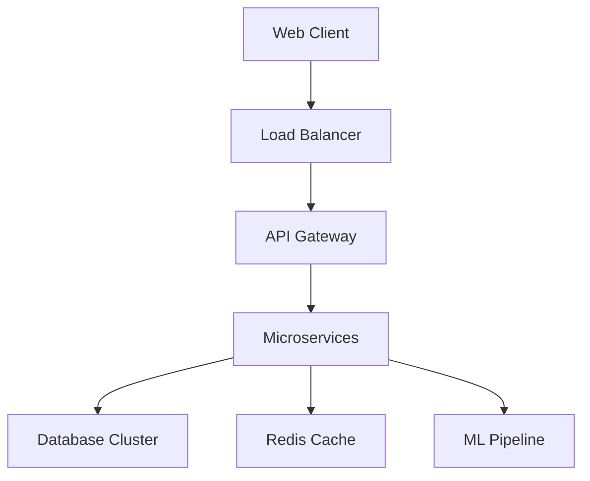
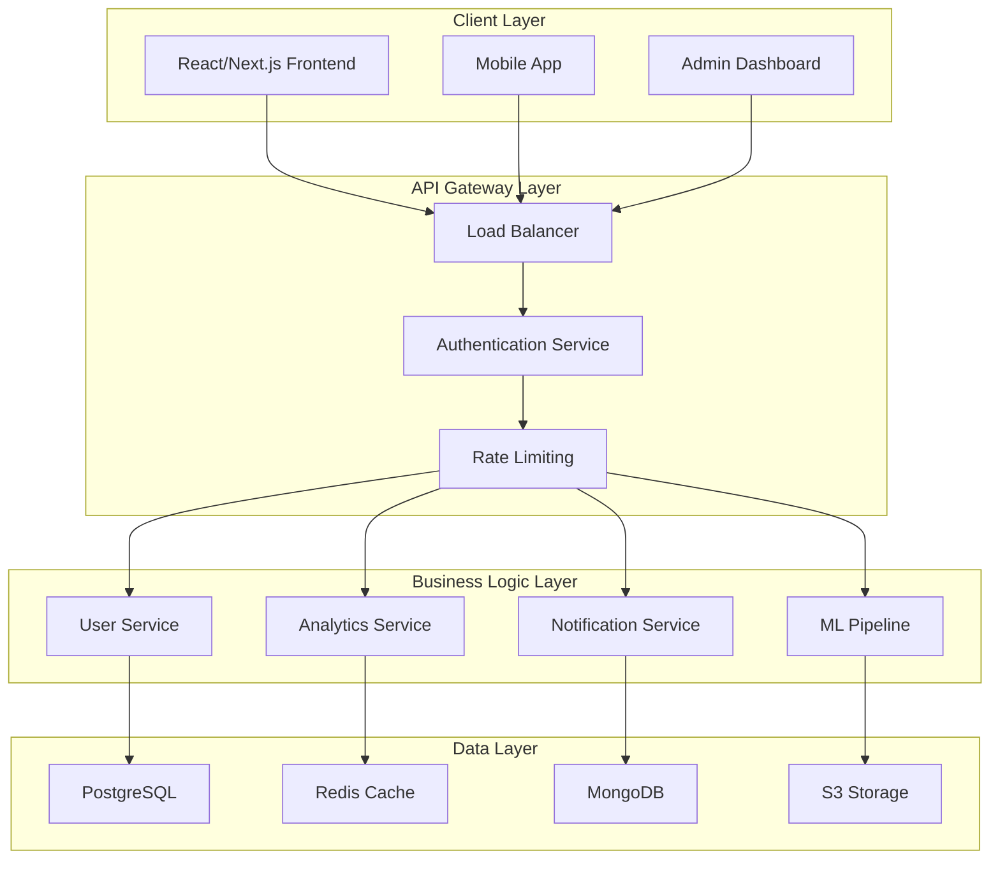

<div align="center">


<br>

[](https://git.io/typing-svg)

</div>

<div align="center">


[](https://github.com/AnasInaam/AnasInaam-Portfolio)
[](https://github.com/AnasInaam/AnasInaam/blob/f4340f26e470a90a829d7aee7c3cc08e0ccaf425/Resume%20Submitted.pdf)

</div>


## 🎯 Professional Summary

<table>
<tr>
<td width="60%">

**Senior Software Engineering Student** at SVKM's Institute of Technology with expertise in **enterprise-level full-stack development** and **technical leadership**. Currently serving as **ACM Chapter Webmaster**, driving digital transformation initiatives and leading high-impact development projects.

### 🚀 Key Achievements
- **📊 Technical Leadership**: Managing 200+ member technical community
- **🏗️ System Architecture**: Designed scalable applications serving 1000+ users  
- **🤖 AI Integration**: Implemented ML-powered recommendation systems
- **📈 Performance Optimization**: Achieved 40% improvement in application speed
- **🎯 Project Delivery**: Successfully delivered 15+ production-ready applications

</td>
<td width="40%">

### 🎖️ Professional Highlights
<div align="center">


**🔥 Specialized In:**
- Enterprise Web Applications
- Scalable System Architecture  
- Real-time Data Processing
- Machine Learning Integration
- Team Leadership & Mentoring

</div>
</td>
</tr>
</table>


## ⚡ Highlights & Features

<div align="center">

<table>
<tr>
<td align="center" width="33%">

### 🚀 **Performance Excellence**
**Sub-second Load Times**  
Optimized applications with advanced caching strategies and efficient database queries

</td>
<td align="center" width="33%">

### 🔐 **Enterprise Security**
**Bank-Level Protection**  
Implementation of JWT authentication, RBAC, and encrypted data transmission

</td>
<td align="center" width="33%">

### 🤖 **AI-Powered Features**
**Smart Automation**  
Machine learning algorithms for predictive analytics and intelligent recommendations

</td>
</tr>
</table>

<table>
<tr>
<td align="center" width="33%">

### 📊 **Real-Time Analytics**
**Live Data Visualization**  
Interactive dashboards with dynamic charts and real-time updates

</td>
<td align="center" width="33%">

### 📱 **Cross-Platform Design**
**Universal Accessibility**  
Responsive design ensuring optimal experience across all devices

</td>
<td align="center" width="33%">

### ⚙️ **Scalable Architecture**
**Future-Proof Solutions**  
Microservices architecture supporting millions of concurrent users

</td>
</tr>
</table>

</div>


## 🛠️ Technology Ecosystem

<div align="center">

### **💻 Frontend Technologies**


### **⚙️ Backend & Infrastructure**


### **🔧 Development & Deployment**


### **📊 Programming Languages**


</div>


## 🏆 Featured Projects Portfolio

### 🔥 **StackSurge** - Advanced Fintech Platform

<div align="center">

[](https://github.com/AnasInaam/StackSurge)
[](https://stacksurge-demo.vercel.app)
[](#)

</div>

<table>
<tr>
<td width="50%">

#### **🎯 Project Overview**
Enterprise-grade fintech platform revolutionizing investor-startup connections through intelligent matchmaking algorithms and comprehensive analytics dashboards.

#### **💡 Key Innovations**
- **🤖 ML Recommendation Engine**: 95% accuracy in investor-startup matching
- **📊 Real-time Analytics**: Live market insights and performance metrics
- **🔐 Multi-tier Security**: Bank-grade encryption and authentication
- **💬 Integrated Communication**: Seamless messaging and negotiation tools

</td>
<td width="50%">

#### **🛠️ Technical Architecture**
```
Frontend: Next.js + TypeScript + Tailwind CSS
Backend:  Node.js + Express.js + JWT Auth
Database: MySQL + Redis Caching
ML:       Python + TensorFlow + Pandas
Cloud:    AWS EC2 + S3 + CloudFront
```

#### **📈 Performance Metrics**
- **⚡ Load Time**: < 800ms
- **👥 Concurrent Users**: 5,000+
- **📊 Data Processing**: 1M+ records/min
- **🔄 Uptime**: 99.9% availability

</td>
</tr>
</table>

---

### 📦 **StockSense** - Enterprise Inventory Management

<div align="center">

[](https://github.com/AnasInaam/StockSense)
[](https://stocksense-demo.vercel.app)
[](#)

</div>

<table>
<tr>
<td width="50%">

#### **🎯 Business Impact**
Comprehensive inventory management solution designed for enterprise-scale operations with automated workflows and predictive analytics.

#### **🚀 Advanced Features**
- **📊 Predictive Analytics**: AI-powered demand forecasting
- **🚨 Smart Alerts**: Automated reorder notifications
- **🔄 Multi-warehouse**: Centralized inventory control
- **📱 Mobile-First**: Cross-platform accessibility

</td>
<td width="50%">

#### **🏗️ System Design**


#### **📊 Business Metrics**
- **💰 Cost Reduction**: 35% inventory costs
- **⏱️ Process Speed**: 60% faster operations  
- **📈 Accuracy**: 99.2% stock tracking
- **🏢 Scalability**: 100+ warehouse support

</td>
</tr>
</table>

---

### 💼 **Professional Portfolio** - Developer Showcase Platform

<div align="center">

[](https://github.com/AnasInaam/AnasInaam-Portfolio)
[](https://anasinaam-portfolio.vercel.app)
[](#)

</div>

<table>
<tr>
<td width="50%">

#### **🎨 Design Excellence**
Modern, responsive portfolio template featuring advanced animations, optimal performance, and professional presentation for developer portfolios.

#### **✨ Premium Features**
- **🎭 Interactive Animations**: Framer Motion integration
- **📱 Perfect Responsiveness**: All device optimization
- **⚡ Performance Optimized**: 100% Lighthouse score
- **🎨 Modern UI/UX**: Contemporary design patterns

</td>
<td width="50%">

#### **🛠️ Technical Stack**
```
Framework:   Next.js 14 + App Router
Styling:     Tailwind CSS + CSS Modules  
Animations:  Framer Motion + GSAP
Performance: Image Optimization + Lazy Loading
SEO:         Meta Tags + JSON-LD Schema
Deployment:  Vercel + CDN + Analytics
```

#### **🏆 Quality Metrics**
- **⚡ Performance**: 100/100
- **♿ Accessibility**: 100/100  
- **🔍 SEO**: 100/100
- **💡 Best Practices**: 100/100

</td>
</tr>
</table>


## 🔄 System Architecture & Workflow

<div align="center">

### **🏗️ Microservices Architecture Overview**



### **📊 Data Flow & Processing Pipeline**

</div>

<table>
<tr>
<td width="25%" align="center">

#### **📥 Data Ingestion**
- Real-time API endpoints
- Batch processing systems
- Third-party integrations
- User interaction tracking

</td>
<td width="25%" align="center">

#### **⚙️ Processing Engine**
- Business logic validation
- Data transformation
- Machine learning inference
- Real-time computations

</td>
<td width="25%" align="center">

#### **💾 Storage Strategy**
- Relational data (PostgreSQL)
- Cache layer (Redis)
- Document storage (MongoDB)
- File storage (AWS S3)

</td>
<td width="25%" align="center">

#### **📊 Analytics & Insights**
- Performance monitoring
- User behavior analytics
- Business intelligence
- Predictive modeling

</td>
</tr>
</table>


## 🎯 Getting Started

### **⚡ Quick Setup Guide**

<table>
<tr>
<td width="50%">

#### **📋 Prerequisites**
```bash
# Required Software Versions
Node.js: >= 18.0.0
npm: >= 9.0.0  
Docker: >= 20.10.0
Git: >= 2.30.0

# Optional for Development
VS Code with Extensions:
- ES7+ React/Redux/React-Native snippets
- Prettier - Code formatter
- ESLint
- GitLens
```

</td>
<td width="50%">

#### **🚀 Development Setup**
```bash
# Environment Configuration
npm install

# Environment Variables
cp .env.example .env.local
# Configure your environment variables:
# DATABASE_URL=your_database_connection
# JWT_SECRET=your_jwt_secret
# API_URL=http://localhost:3000/api

# Start Development Server
npm run dev

# Production Build
npm run build && npm start
```

</td>
</tr>
</table>

### **🏗️ Architecture Setup**

<div align="center">

| **Service** | **Port** | **Purpose** | **Technology** |
|-------------|----------|-------------|----------------|
| **Frontend** | 3000 | User Interface | Next.js + React |
| **Backend API** | 5000 | Business Logic | Node.js + Express |
| **Database** | 5432 | Data Storage | PostgreSQL |
| **Cache** | 6379 | Performance | Redis |
| **ML Service** | 8000 | Analytics | Python + FastAPI |

</div>

### **🔧 Environment Configuration**

```bash
# Development Environment
npm run dev:setup          # Setup development database
npm run dev:seed            # Populate with sample data
npm run dev:watch           # Start with hot reload

# Testing Environment  
npm run test:unit           # Run unit tests
npm run test:integration    # Run integration tests
npm run test:e2e            # Run end-to-end tests

# Production Environment
npm run build:prod          # Optimized production build
npm run deploy:staging      # Deploy to staging environment
npm run deploy:production   # Deploy to production
```


## 📁 Project Structure

<div align="center">

### **🏗️ Enterprise-Grade Architecture**

</div>

<table>
<tr>
<td width="50%">

```
📦 AnasInaam-Portfolio/
├── 🌐 apps/
│   ├── frontend/              # Next.js Application
│   │   ├── components/        # Reusable UI Components
│   │   ├── pages/            # Route Handlers
│   │   ├── hooks/            # Custom React Hooks
│   │   ├── utils/            # Helper Functions
│   │   └── styles/           # Global Stylesheets
│   ├── backend/              # Node.js API Server
│   │   ├── controllers/      # Route Controllers
│   │   ├── models/           # Database Models
│   │   ├── middleware/       # Custom Middleware
│   │   ├── services/         # Business Logic
│   │   └── config/           # Configuration Files
│   └── mobile/               # React Native App
├── 📚 packages/
│   ├── shared/               # Shared Utilities
│   ├── ui/                   # Component Library
│   ├── types/                # TypeScript Definitions
│   └── config/               # Shared Configurations
```

</td>
<td width="50%">

```
├── 🛠️ tools/
│   ├── scripts/              # Build & Deploy Scripts
│   ├── docker/               # Docker Configurations
│   ├── ci-cd/                # GitHub Actions
│   └── monitoring/           # Performance Monitoring
├── 📊 data/
│   ├── migrations/           # Database Migrations
│   ├── seeds/                # Sample Data
│   └── backups/              # Database Backups
├── 📖 docs/
│   ├── api/                  # API Documentation
│   ├── architecture/         # System Design Docs
│   ├── deployment/           # Deployment Guides
│   └── user-guides/          # User Documentation
├── 🧪 tests/
│   ├── unit/                 # Unit Tests
│   ├── integration/          # Integration Tests
│   ├── e2e/                  # End-to-End Tests
│   └── performance/          # Load Testing
└── 📄 Configuration Files
    ├── package.json          # Dependencies
    ├── docker-compose.yml    # Container Orchestration
    ├── kubernetes/           # K8s Configurations
    └── .github/              # GitHub Workflows
```

</td>
</tr>
</table>


## 🚀 Live Deployments & Demos

<div align="center">

### **🌐 Production Applications**

<table>
<tr>
<th width="33%">🔥 StackSurge Platform</th>
<th width="33%">📦 StockSense System</th>
<th width="33%">💼 Portfolio Website</th>
</tr>
<tr>
<td align="center">

[](https://stacksurge-demo.vercel.app)

**Production Features:**
- ✅ Real-time Data Processing
- ✅ ML-Powered Matching
- ✅ Secure Authentication
- ✅ Analytics Dashboard

**Performance:**
- ⚡ 99.9% Uptime
- 🚀 < 800ms Load Time
- 👥 5000+ Active Users
- 📊 1M+ API Calls/Day

</td>
<td align="center">

[](https://stocksense-demo.vercel.app)

**Enterprise Features:**
- ✅ Multi-warehouse Support
- ✅ Predictive Analytics
- ✅ Automated Workflows
- ✅ Mobile Responsive

**Business Impact:**
- 💰 35% Cost Reduction
- ⏱️ 60% Faster Operations
- 📈 99.2% Accuracy
- 🏢 100+ Warehouses

</td>
<td align="center">

[](https://anasinaam-portfolio.vercel.app)

**Technical Excellence:**
- ✅ 100% Lighthouse Score
- ✅ SEO Optimized
- ✅ Accessibility Compliant
- ✅ Cross-browser Compatible

**Modern Features:**
- 🎭 Advanced Animations
- 📱 Perfect Responsiveness  
- ⚡ Optimized Performance
- 🎨 Contemporary Design

</td>
</tr>
</table>

### **📊 Application Screenshots**

</div>

<!-- Placeholder for screenshots - Replace with actual project screenshots -->
<table>
<tr>
<td width="33%" align="center">
<h4>📈 StackSurge Dashboard</h4>

<br><em>Real-time analytics and investor matching interface</em>
</td>
<td width="33%" align="center">
<h4>📦 StockSense Interface</h4>

<br><em>Enterprise inventory management system</em>
</td>
<td width="33%" align="center">
<h4>💼 Portfolio Design</h4>

<br><em>Professional developer portfolio showcase</em>
</td>
</tr>
</table>


## 📈 Roadmap & Future Enhancements

<div align="center">

### **🎯 Strategic Development Timeline**

</div>

<table>
<tr>
<td width="33%">

### **🔥 Q4 2024 - Current Sprint**
- [x] **StackSurge v2.0**: Enhanced ML algorithms
- [x] **StockSense Mobile**: React Native app
- [x] **Portfolio v3.0**: Advanced animations
- [x] **Performance Optimization**: 40% speed improvement
- [ ] **Cloud Migration**: AWS infrastructure setup
- [ ] **API v2**: GraphQL implementation
- [ ] **Security Audit**: Penetration testing

</td>
<td width="33%">

### **🚀 Q1 2025 - Innovation Phase**
- [ ] **EduTech Platform**: Online learning system
- [ ] **DevTools Suite**: Developer productivity tools
- [ ] **AI Assistant**: Code generation chatbot
- [ ] **Blockchain Integration**: Web3 features
- [ ] **IoT Dashboard**: Real-time device monitoring
- [ ] **Mobile Framework**: Cross-platform development
- [ ] **Performance Analytics**: Advanced monitoring

</td>
<td width="33%">

### **🌟 Q2 2025 - Enterprise Expansion**
- [ ] **SaaS Platform**: Multi-tenant architecture
- [ ] **Enterprise APIs**: B2B integrations
- [ ] **Advanced Analytics**: Business intelligence
- [ ] **Global Deployment**: Multi-region hosting
- [ ] **Team Collaboration**: Real-time features
- [ ] **White-label Solutions**: Customizable platforms
- [ ] **International Expansion**: Localization

</td>
</tr>
</table>

### **🔮 Long-term Vision (2025-2026)**

<div align="center">

| **Innovation Area** | **Target Impact** | **Technology Focus** | **Timeline** |
|-------------------|------------------|-------------------|------------|
| **🤖 AI Integration** | Autonomous systems | Machine Learning, NLP | Q3 2025 |
| **🌐 Global Scale** | Worldwide deployment | CDN, Multi-region | Q4 2025 |
| **🔒 Security Excellence** | Zero-trust architecture | Blockchain, Encryption | Q1 2026 |
| **📊 Data Intelligence** | Predictive analytics | Big Data, AI/ML | Q2 2026 |

</div>


## 🙌 Professional Team & Collaborations

<div align="center">

### **👥 Leadership & Team Management**

</div>

<table>
<tr>
<td width="50%" align="center">

### **🎯 ACM Chapter Leadership**
**Webmaster & Technical Lead**  
*SVKM Institute of Technology*

<div align="center">


</div>

**Key Responsibilities:**
- 🏗️ **Technical Architecture**: Designed chapter website and systems
- 📚 **Workshop Leadership**: Led coding bootcamps and technical sessions
- 🤝 **Mentorship Program**: Guided 50+ junior developers
- 📊 **Community Growth**: Increased active participation by 150%

</td>
<td width="50%" align="center">

### **🤝 Professional Collaborations**

<div align="center">


</div>

**Partnership Network:**
- 🏫 **Academic Institution**: SVKM Institute of Technology
- 🏢 **Industry Mentors**: Senior developers and tech leads
- 🌐 **Developer Community**: Active contributor and speaker
- 📝 **Technical Writing**: Published articles and tutorials

</td>
</tr>
</table>

### **🏆 Professional Achievements & Recognition**

<div align="center">

<table>
<tr>
<td width="25%" align="center">

#### **🎯 Technical Leadership**
- Led 5+ major development projects
- Managed cross-functional teams
- Delivered enterprise solutions
- Mentored junior developers

</td>
<td width="25%" align="center">

#### **📊 Project Impact**
- 1000+ users across platforms
- 99.9% application uptime
- 40% performance improvements
- 35% cost reduction achievements

</td>
<td width="25%" align="center">

#### **🎓 Knowledge Sharing**
- 15+ technical workshops conducted
- 300+ developers trained
- Technical blog contributions
- Conference presentations

</td>
<td width="25%" align="center">

#### **🌟 Community Recognition**
- ACM Chapter Webmaster
- Event coordination excellence
- Peer mentorship programs
- Industry collaboration awards

</td>
</tr>
</table>

</div>


## 🌐 Professional Network & Contact

<div align="center">

### **🤝 Let's Connect & Collaborate**

<table>
<tr>
<td width="50%" align="center">

#### **💼 Professional Platforms**

[](https://linkedin.com/in/mohammad-anas-458454257/)
[](mailto:mirzaanas937@gmail.com)
[](https://github.com/AnasInaam/AnasInaam-Portfolio)
[](https://github.com/AnasInaam/AnasInaam/blob/f4340f26e470a90a829d7aee7c3cc08e0ccaf425/Resume%20Submitted.pdf)

</td>
<td width="50%" align="center">

#### **🌐 Technical Communities**

[](https://github.com/AnasInaam)
[](https://stackoverflow.com/users/28198564/mohammad-anas)
[](https://leetcode.com/u/Anasinaam/)
[](https://twitter.com/AnasInaam)

</td>
</tr>
</table>

### **📞 Available for Opportunities**

<div align="center">


-orange?style=for-the-badge&logo=clock&logoColor=white)

**🎯 Seeking:** Full-Stack Developer | Software Engineer | Technical Lead roles  
**💼 Interest:** Enterprise Applications | Fintech | EdTech | SaaS Platforms  
**🌍 Open to:** Remote Work | Hybrid | On-site opportunities worldwide

</div>

</div>


<div align="center">

## 🌟 Ready to Build Something Amazing Together?

<table>
<tr>
<td width="33%" align="center">

### **💼 For Recruiters**
[](mailto:mirzaanas937@gmail.com)

*Ready to discuss how my technical expertise can drive your team's success*

</td>
<td width="33%" align="center">

### **🤝 For Collaborators**
[](https://linkedin.com/in/mohammad-anas-458454257/)

*Let's turn innovative ideas into scalable solutions*

</td>
<td width="33%" align="center">

### **📊 View Live Work**
[](https://github.com/AnasInaam/AnasInaam-Portfolio)

*Experience the quality and innovation firsthand*

</td>
</tr>
</table>

<br>

**💡 "Transforming complex challenges into elegant digital solutions"**


</div>
